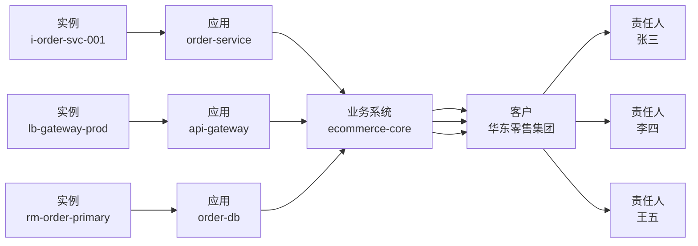

# 告警业务影响评估报告

> 生成时间：2026-09-01 08:13:55 UTC  
> 数据来源：mock（Apsara Stack 只读 API 演示）  
> 评估告警数：3  
> 地域：cn-hangzhou-1 / 可用区：cn-hangzhou-1-a

---

## 1. 执行摘要

| 级别 | 数量 | 建议动作 |
|------|------|----------|
| P1（立即介入） | 3 条 | 技术团队第一时间介入，15 分钟同步进展 |
| P2（观察） | 0 条 | — |
| P3（可延后） | 0 条 | — |

**结论**：3 条告警均归属同一业务系统（ecommerce-core）与 VPC（vpc-core-prod），检测到同源关联，建议合并分析并按 P1 处置。

---

## 2. 资源-业务链路图

**链路还原路径**：云资源 API → CMDB lineage → 标签 fallback

---

## 3. 客户感知指标快照（近 30 分钟）

| 告警 ID | 资源 | QPS | 错误率 | P99 延迟 | 趋势 | 感知等级 |
|---------|------|-----|--------|----------|------|----------|
| alm-20260831-001 | i-order-svc-001 | 1250 (rising) | 6.2% (rising) | 820ms (rising) | 错误率上升 | **严重影响** |
| alm-20260831-002 | lb-gateway-prod | 8500 (stable) | 1.2% (stable) | 120ms (stable) | 稳定 | 轻微影响 |
| alm-20260831-003 | rm-order-primary | 320 (stable) | 0.5% (stable) | 45ms (stable) | 稳定 | 正常 |

**感知判定规则**：
- 错误率 > 5% 且上升 → 严重影响
- 错误率 > 2% 或 P99 > 500ms → 明显影响
- 错误率 > 0.5% 或 P99 > 200ms → 轻微影响

---

## 4. 关联告警聚合结果

- **告警总数**：3 条
- **聚合组** `ecommerce-core` / `vpc-core-prod`：3 条
  - alm-20260831-001, alm-20260831-002, alm-20260831-003
- **聚合结论**：检测到同源关联告警，建议合并分析，优先排查网络链路或共享依赖
- **预案匹配**：
  - alm-001 → RB-005 多告警关联-同 VPC 网络抖动
  - alm-002 → RB-002 SLB 后端单节点不健康
  - alm-003 → RB-001 数据库只读实例延迟

---

## 5. 告警明细

### alm-20260831-001 — ECS CPU 使用率过高

- 资源：ecs/i-order-svc-001
- 地域/可用区：cn-hangzhou-1 / cn-hangzhou-1-a
- 触发：CPUUtilization = 92.5（阈值 90）
- 业务系统：ecommerce-core
- 客户：华东零售集团
- 责任人：张三（138****5678）
- 链路来源：cmdb

### alm-20260831-002 — SLB 后端不健康主机数

- 资源：slb/lb-gateway-prod
- 地域/可用区：cn-hangzhou-1 / cn-hangzhou-1-a
- 触发：UnhealthyHostCount = 1（阈值 0）
- 业务系统：ecommerce-core
- 客户：华东零售集团
- 责任人：李四
- 链路来源：cmdb

### alm-20260831-003 — RDS 只读实例延迟

- 资源：rds/rm-order-primary
- 地域/可用区：cn-hangzhou-1 / cn-hangzhou-1-a
- 触发：ReplicationDelay = 45（阈值 30）
- 业务系统：ecommerce-core
- 客户：华东零售集团
- 责任人：王五
- 链路来源：cmdb
